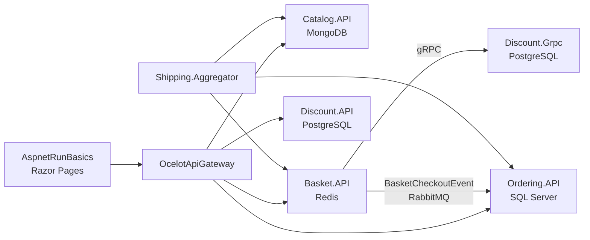

# AspnetMicroservices

An e-commerce system of .NET microservices behind an **Ocelot** API gateway: catalog, basket, discount and ordering. Services talk to each other over **gRPC** and **RabbitMQ** (MassTransit), and the system has centralised logging and health monitoring.

> **Study project (July 2021 – January 2022)**, built while following an online course. The Razor Pages client (`AspnetRunBasics`) comes from that material. The commit history shows the system built up step by step: services, Docker, logging, retry policies, health checks.

## Architecture



| Service | Responsibility | Storage / tech |
|---|---|---|
| `Catalog.API` | Product catalogue | MongoDB |
| `Basket.API` | Shopping basket; gets discounts over gRPC; publishes `BasketCheckoutEvent` on checkout | Redis, gRPC client, MassTransit |
| `Discount.API` / `Discount.Grpc` | Coupons, over REST and gRPC | PostgreSQL, Dapper |
| `Ordering.API` | Orders, in Clean Architecture layers (Domain, Application, Infrastructure); consumes `BasketCheckoutEvent` | SQL Server, EF Core, MediatR, FluentValidation |
| `OcelotApiGateway` | Single entry point that routes to the services | Ocelot |
| `Shipping.Aggregator` | Combines catalog, basket and order data into one response | Typed `HttpClient`s |
| `WebStatus` | Health dashboard for all services | HealthChecks UI |

Ordering uses MediatR commands and queries (`CheckoutOrder`, `UpdateOrder`, `DeleteOrder`, `GetOrdersList`) with validation and unhandled-exception pipeline behaviours.

## Cross-cutting concerns

- **Logging:** Serilog to Elasticsearch, viewed in Kibana (`Common.Logging` building block).
- **Resilience:** Polly retry and circuit-breaker policies on the aggregator's HTTP clients, and retries around database migration at startup.
- **Health checks:** every API exposes health endpoints that check its database or cache, shown together in `WebStatus`.

## Running locally

```bash
cd src
cp .env.example .env   # choose local database passwords
docker compose -f docker-compose.yml -f docker-compose.override.yml up -d --build
```

This starts the databases, RabbitMQ, Elasticsearch, Kibana and all services. Ports are listed in `docker-compose.override.yml`.

## How I would build it today

- **Transactional outbox for `BasketCheckoutEvent`**, so the basket and the published checkout always agree.
- **Tests at every layer:** unit tests for the MediatR handlers and validators, and integration tests for each API against real databases with Testcontainers.
- **Secrets from a secret store.** Local runs read passwords from a git-ignored `.env` file; deployed environments would use a vault.
- **A supported .NET version** for all services.
